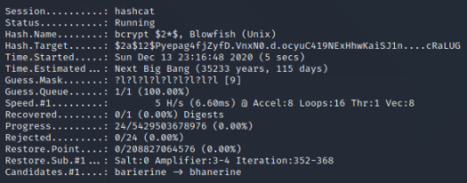

**1.0 Executive Summary**

This report details the results of a penetration test on the SecureBiz web application. This follows an automated security scan during Iteration 0, which identified a range of possible threats. The most recent tests were performed on the version of the web application at the end of Iteration 0 and focused on authentication and authorisation. More specifically, the tests focused on the admin login portal, the absence of authentication tokens and client-side routes. The overall findings of the report are that security can be improved by limiting the number of unsuccessful login attempts, using authorisation tokens, and hiding the routes from the client-side.

**2.0 Body**

A penetration test of the SecureBiz web application was undertaken in early December 2020. Burpsuite, Hashcat and Postman were used to test the applications' authentication and authorisation services. More specifically, the tests focused on the admin login portal, the absence of authentication tokens and client-side routes. The following report details the results and provides an analysis in the context of the SecureBiz web application. This is followed by a set of recommendations.

**2.1 Admin Portal**

Two attack vectors were used to test the security of the admin login portal. Firstly, Burpsuite was used to assess if the portal was vulnerable to a dictionary attack. This attack assumes that the adversary knows the admin username, ‘securebiz’. The result of the test is illustrated below.

*Figure 1: Burpsuite dictionary attack results*

Whilst the dictionary only contained 10 words, the attack correctly identified ‘securebiz’ as the password. This is illustrated by the **200** success status of the **HTTP** request. The attack demonstrated that there are no failed login attempt limits on the application.

The second attack vector was through the hashed password in the MongoDB database, which could be used to login to the portal if cracked. This assumes that the adversary gains access to the database, which is password protected. The database contains the 'admin' username in plain-text and the password is hashed using bcrypt. A dictionary attack using Hashcat demonstrated that the bcrypt hash could be cracked.

*Figure 2: Hashcat dictionary attack results*

But the dictionary only contained 10 passwords and the strength of bcrypt is in the time it takes to hash each candidate password. Therefore, a more real-world penetration test was undertaken using a brute-force attack. Even with a mask, which identified the password as nine lowercase characters, Hashcat predicted the hash would take over 35 000 years to crack on the penetration tester's computer. This time would be reduced significantly on a machine with multiple CPUs, but the attack would remain impractical.

*Figure 3: Hashcat masked brute-force attack*

The results of the penetration tests revealed that, whilst bcrypt is very strong, the admin portal should be made more secure by using a less obvious admin username and setting a failed login attempt limit. A short-term solution could include adding a rate limiter. These two solutions would mitigate the threat of a brute force or dictionary attack. 

**2.2 Absence of authentication tokens**

A previous automated scan using OWASP Zap indicated that the application may be vulnerable to cross-site request forgery (CSRF) attacks. The two vulnerable parts of the application are Register New Administrator and Manage Mitigation Strategies. To validate the alert, Burpsuite was used to intercept the **POST** request to register a new administrator. The result is illustrated in Figure 4.

*Figure 4: Intercepting POST request to /register route*

The request revealed the name of the route, the names of the fields in the MongoDB database and that an authentication token was not included in the request. The absence of authentication tokens makes the website highly vulnerable to CSRF attacks. Although it is not a conventional security tool, Postman was used to send a **POST** request to the **/register** route to validate if a new administrator could be registered without an authentication token. The attack was successful. The risk of this attack vector is low, as the name of the route can only be found by intercepting the **POST** request behind the admin portal.

*Figure 5: Successful CSRF attack using Postman*

**2.3 Client-side routes**

Based on the results of the previous CSRF attack, further investigation was undertaken to identify if an adversary could find the **/register** route without getting passed the admin portal. A **GET** request to the root route in Figure 6 revealed all of the routes used by the web application, including **/register**.

*Figure 6: GET request to root route in Postman*

Most importantly, an adversary can make this **GET** request without being behind the admin portal. The potential damage caused by this attack vector is significant. This includes registering a new administrator who can then log into the admin portal, defacing the application by changing the questions, and stealing user information. To mitigate the threat of these attacks, the root route must be blocked from the client-side. This will most liley be achieved when the web application is deployed to the Cloud.

**3.0 Recommendations**

Based upon the results of the penetration tests, the following actions are recommended: 

- Use a less obvious admin username and password combination 
- Place a limit on the number of unsuccessful login attempts
- Use authorisation tokens
- Block the root route from the client-side

