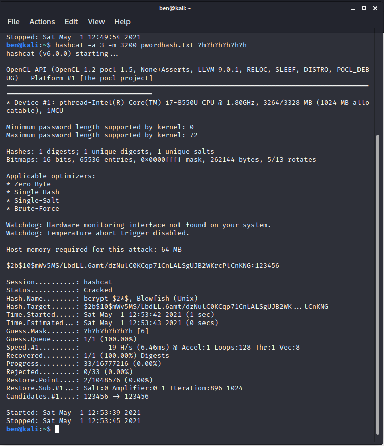
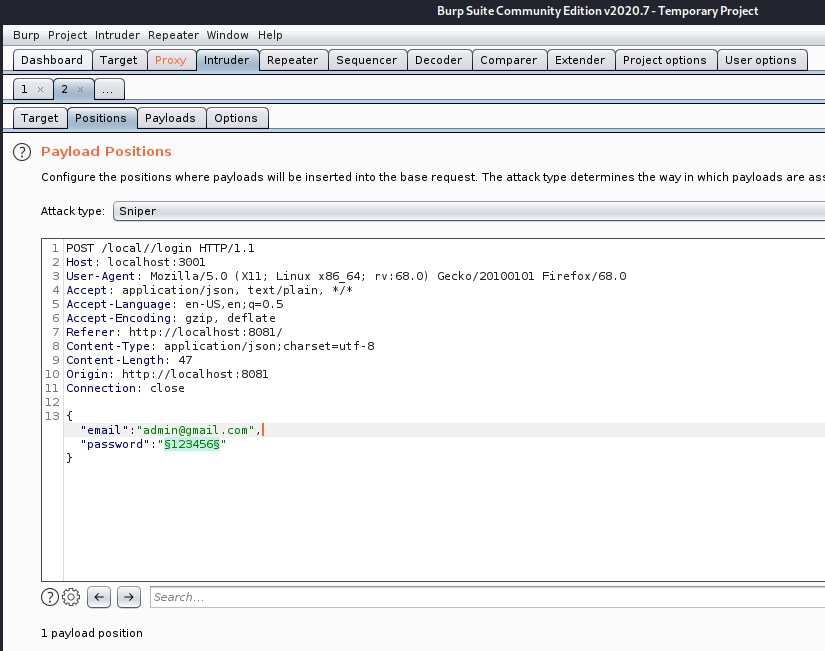
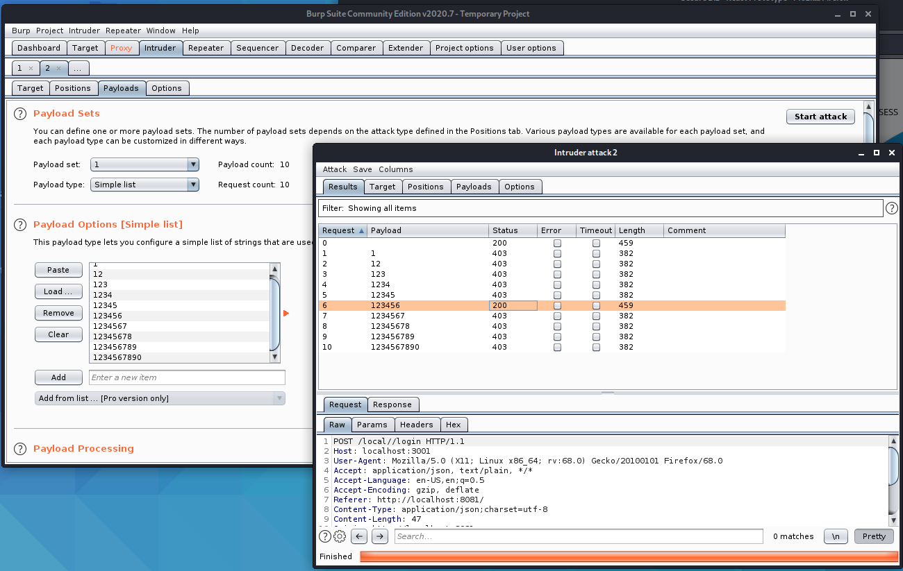
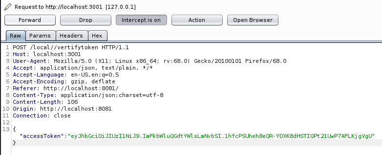
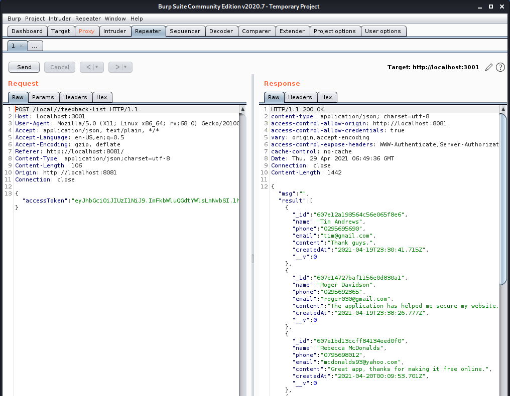
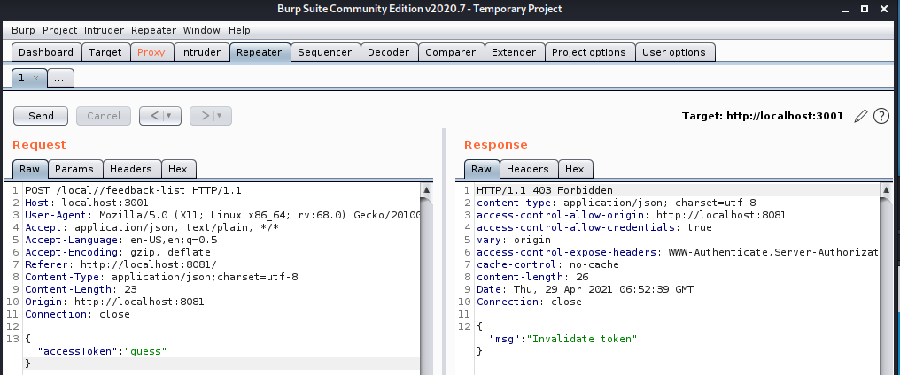
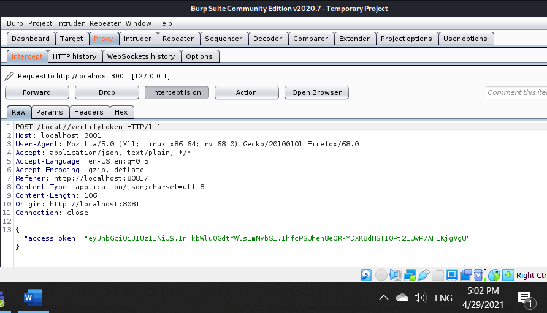
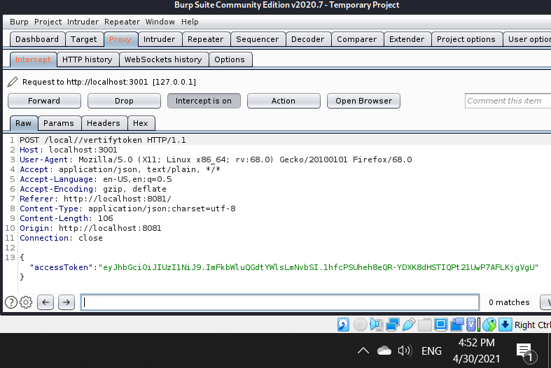
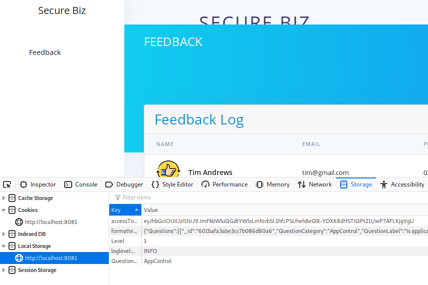
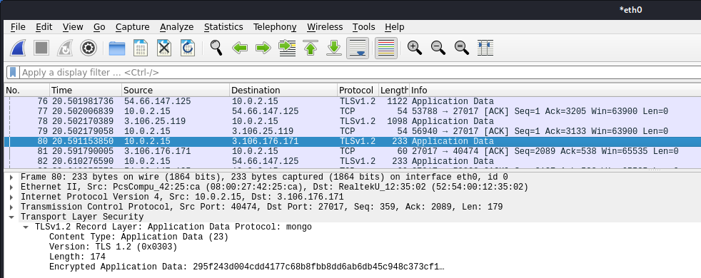

#PENTEST REPORT ITERATION 03 T1 2021#

**1.0 Purpose**
#Shaun - Remove this
The pupose of this report is to outline any vunrabilities discovered on the ASD8 Web App during iteration 02 T1 2021.
The findings from this report will help inform future work in refining this product.
**1.1 Methodology
#Shaun - Remove this
After extensive investigation it was concluded that setting up a closed environment with webserver to host the ASD8 Web app, victum to access the web app and attacker to intecept and manipulate packets (Man in the Middle - MitM) was not feasible due to limitations caused by serverless-offline and MongoDB deployment on a local network.
The following penetration tests are conducted on Kali Linux virtual machines which are in a closed environment, with the Kali machine acting as all three entities at once, although not the most robust solution, the findings below will still provide useful feedback to future development and inform testing during iteration 03 T1 2021.
After engaging the tech team about this it was concluded that it should be possible to setup a deployed pen testing environment for use in iteration 03 T1 2021.

**2.0 Penetration Tests**
**2.1 Password**
#BEN - Remove this
The credentials for the Secure Biz web application are stored in a table in the MongoDB database. The username ‘admin’ is stored in plain text and the password ‘123456’ is hashed using Bcrypt. Hashcat was used to undertake a masked brute force attack on the password hash. Whilst Bcrypt is one of the most computationally expensive hashing algorithms, Hashcat cracked the password in 1 second. This is because the password is very close to the start of the key space used in the brute force attack.

_Fig. 1. brute force attack_

Another method an attacker can use is a brute force attack on the application itself. This is demonstrated using Burpsuite. In Fig. 2, the payload position was set to the position of the password field.

_Fig. 2. payload position_

Ten passwords were then sent to the application using the Attack tool in Burpsuite. In a real-world scenario, an attacker would use a dictionary of common passwords. The status 200 response in Fig. 3 reveals that ‘123456’ is the correct password. This password is only used for development purposes and needs to be changed when the application is deployed. However, even when the password is reset, the login portal can be made more secure by limiting the number of failed login attempts. This will mitigate the threat of a brute force attack.

_Fig. 3. Burpsuite password attack results_

#Shaun - Remove this

**2.2 Access token**
#BEN - Remove this
Last trimester, a penetration test on the application demonstrated that it was vulnerable to cross-site request forgery attacks as it did not use access tokens. In Iteration 1, access tokens were implemented in the admin portal. The screenshot below demonstrates that the POST request includes an access token in the body. This provides the recently authenticated user with access to the admin portal. 

_Fig. 4. access token captured in POST request_

When inside the admin portal, the user is provided with a user feedback list – displayed in JSON format in Fig. 5. This can only be accessed if a valid access token is included in the POST request. The repeater tool in Burpsuite demonstrated that this could be done without firstly logging into the admin portal, as the request only checks the validity of the access token.

_Fig. 5. Repeater tool used to retreive user feedback_

Modifying the access token to “guess” demonstrated that an attacker cannot retrieve the user feedback list without a valid token.

_Fig. 6. User feedback cannot be accessed without a valid token_

A test was then undertaken to find out if the access token has a short expiry date. POST requests for separate logins were captured approximately twenty-four hours apart. Fig. 7 and 8 demonstrate that the token did not expire. This makes the application vulnerable to replay attacks.

_Fig. 7. access token on 29/4/2021 at 5:02pm_

_Fig. 8. access token at 30/4/2021 at 4:52pm_

Given that the username and password are not required to view the user feedback, an adversary can view this sensitive information if they can steal the access token. The access token is stored in local storage. This makes the access token available to any scripts in the application, including scripts that have been added to the feedback page through injection attacks. If this occurs, the application administrator may inadvertently send the attacker their access token after they login to the admin portal. A more secure method for storing JWT tokens is in the browser.

_Fig. 9. access token saved in local storage_

Packet sniffing is another method that adversaries can use to steal sensitive information, including passwords and tokens. A test was completed using Wireshark to see if this information is revealed when a user logs into the application. Fig. 8 demonstrates that all data sent to and received from the MongoDB database is encrypted. This is a standard MongoDB application security protocol, which protects data in-transit from packet sniffing.

_Fig 10. Packet capture using Wireshark_

#Shaun - Remove this

**3.0 Initial Recommendations**
#Shaun - Remove this
Based on penetration tests carried out by Ben Landers and Shaun Dare during iteration 02 T1 2021 the following recommendations are put forward to help increase the security posture of the ASD8 Web App

**4.0 Verification - Iteration 03**

**5.0 Finilised recommendations**
