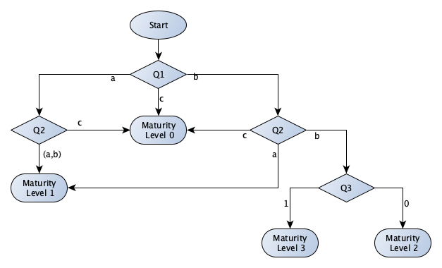
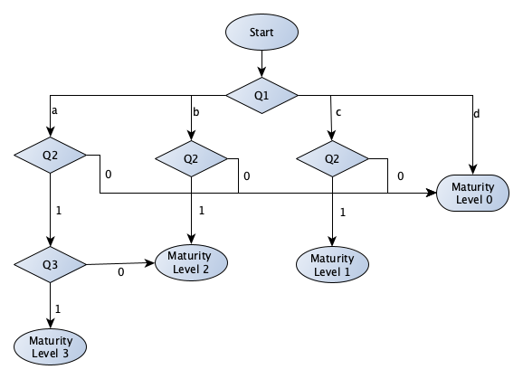
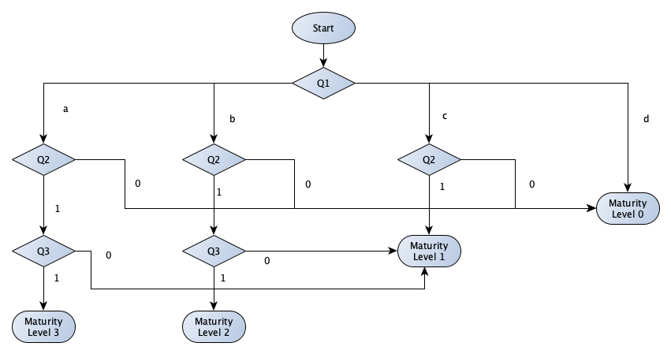
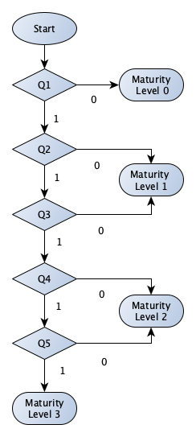
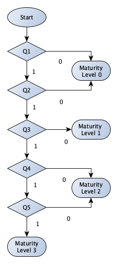
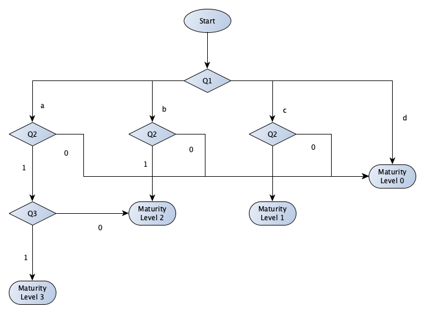
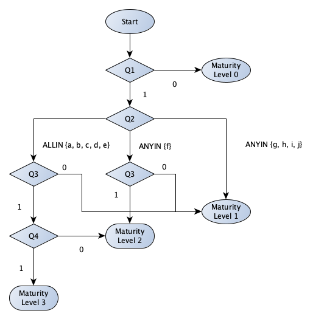
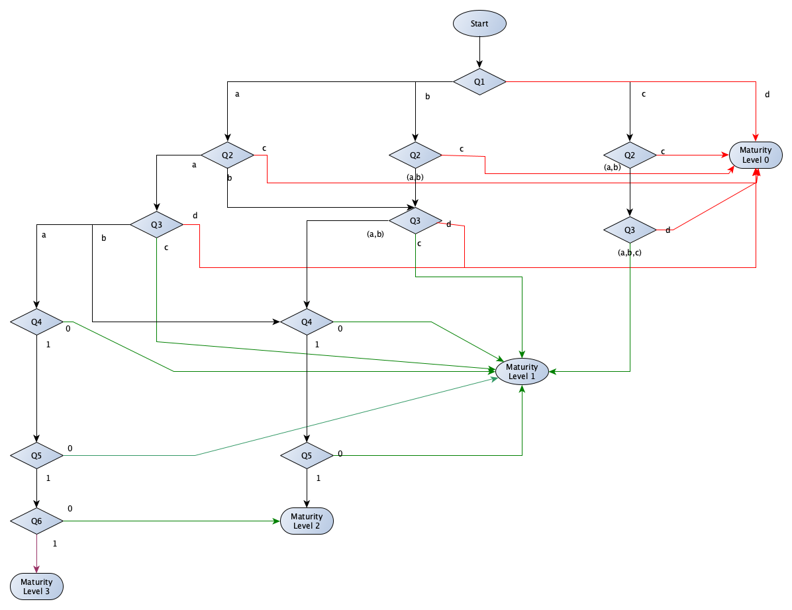

# Maturity Level calculations

The following questions and responses implement the [Essential Eight Maturity Model](https://www.cyber.gov.au/acsc/view-all-content/publications/essential-eight-maturity-model). The model defines [eight essential baseline strategies](https://www.cyber.gov.au/acsc/view-all-content/publications/essential-eight-explained) to reduce expose to cyber security incidents.

Mitigation Strategies to Prevent Malware Delivery and Execution:

1. Application control
2. Patch applications
3. Configure Microsoft Office macro settings
4. User application hardening

Mitigation Strategies to Limit the Extent of Cyber Security Incidents:

5. Restrict administrative privileges
6. Patch operating systems
7. Multi-factor authentication
8. Daily backups

The model defines three maturity levels that can be applied to each ASD mitigation strategy:

Maturity Level 1: Organisation is partly aligned with the ASD mitigation strategy.<br>
Maturity Level 2: Organisation is mostly aligned with the ASD mitigation strategy. <br>
Maturity Level 1: Organisation is fully aligned with the ASD mitigation strategy.

We have added a precursor level:

Maturity Level 0: Organisation is no aligned with the ASD mitigation strategy.

### Implementation notes

The following document specified the core questions for each mitigation strategy, and available responses. The questions and responses for each mitigation strategy are mapped on a flowchart, indicating where decision points are for maturity level assignments.

This was then expressed as a sequence of pseudo-logic assignment rules.

_An assignment of a level terminates the calculation, but it does not necessarily terminate the questionnaire._

## 1. Application Control

### Questions and responses

|Number  |Question  |Responses  |
|------- |--------- |---------- |
|Q1  |Is application control implemented on all workstations to restrict the execution to an approved set of |a. executables<br>b. executables, software libraries, scripts and installers<br>c. none of the above  |
|Q2  |Is application control implemented on all servers to restrict the execution to an approved set of |a. executables<br>b. executables, software libraries, scripts and installers<br>c. none of the above  |
|Q3  |Are Microsoft’s latest recommended block rules implemented to prevent application control bypasses?  |Yes = 1/No = 0  |

<p style="text-align: center"></p>

### Level 0 logic

```
{q(1).answer} == "c"
OR {q(2).answer} == "c" ? {level} = 0
```

### Level 1 logic

```
{q(1).answer} == "a"
AND ({q(2).answer} == "a" OR {q(2).answer} == "b") ? {level} = 1
```

```
{q(1).answer} == "b"
AND ({q(2).answer} == "a") ? {level} = 1
```
### Level 2 logic

```
{q(1).answer} == "b"
AND {q(2).answer} == "b" 
AND {q(3).answer} == 0 ? {level} = 2
```

### Level 3 logic

```
{q(1).answer} == "b"
AND {q(2).answer} == "b" 
AND {q(3).answer} == 1 ? {level} = 3
```

## 2. Patch Applications

### Questions and responses

|Number  |Question  |Responses  |
|------- |--------- |---------- |
|Q1  |If a critical security vulnerability is identified, how quickly do you apply an appropriate patch, update or mitigation for the affected system or application? |a. Within 48 hours<br>b. Within two weeks<br>c. Within one month<br>d. Longer than one month  |
|Q2  |Do you update or replace systems and applications where the vendor has ceased providing patches and updates?  |Yes = 1, No = 0  |
|Q3  |Do you have an automated process that confirms and records the successful installation of patches and updates for applications? |Yes = 1, No = 0  |


<p style="text-align: center"></p>

### Level 0 logic

```
{q(1).answer} == "d"
OR {q(2).answer} == 0 ? (level) = 0
```

### Level 1 logic

```
{q(1).answer} == "c"
AND {q(2).answer} == 1 ? (level) = 1
```

### Level 2 logic

```
{q(1).answer} == "b"
AND {q(2).answer} == 1 ? (level) = 2
```

```
{q(1).answer} == "a"
AND {q(2).answer} == 1
AND {q(3).answer} == 0 ? (level) = 2
```

### Level 3 logic

```
{q(1).answer} == "a"
AND {q(2).answer} == 1
AND {q(3).answer} == 1 ? (level) = 3
```

## 3. Configure Microsoft Office macro settings

### Questions and responses

|Number  |Question  |Responses  |
|------- |--------- |---------- |
|Q1  |Please choose the most relevant answer for your current macro security setup:  |a. Microsoft Office macros are only allowed to execute from trusted locations where write access is locked down to administrators who appropriately evaluate macros before adding files into these locations <br>b. Only digitally signed Microsoft Office Macros from trusted publishers are allowed to execute <br>c. Microsoft Office macros are allowed to execute after user approval<br>d. None of the above  |
|Q2  |Are Microsoft Office macro settings configured so that end users cannot change settings?|Yes = 1, No = 0  |
|Q3  |Do you block Microsoft Office macros in documents that originate from the internet?  |Yes = 1, No = 0  |

<p style="text-align: center"></p>

### Level 0 logic

```
{q(1).answer} == "d"
OR {q(2).answer} == 0 ? (level) = 0
```

### Level 1 logic

```
{q(1).answer} == "c"
AND {q(2).answer} == 1 ? (level) = 1
```

```
({q(1).answer} == "a" OR {q(1).answer} == "b")
AND {q(2).answer} == 1
AND {q(3).answer} == 0 ? (level) = 1
```

### Level 2 logic

```
{q(1).answer} == "b"
AND {q(2).answer} == 1
AND {q(3).answer} == 1 ? (level) = 2
```

### Level 3 logic

```
{q(1).answer} == "a"
AND {q(2).answer} == 1
AND {q(3).answer} == 1 ? (level) = 3
```

*__Note__: current logic does not include (d) as an option. And is suggested in order to simplify the logic, and plug a gap in responses. Currently there is no way to answer question if none apply.*

## 4. User Application Hardening

### Questions and responses

|Number  |Question  |Responses  |
|------- |--------- |---------- |
|Q1  |Is Adobe Flash blocked or disabled on all browsers on devices which connect to your network?  |Yes = 1, No = 0  |
|Q2  |Are web advertisements blocked on all browsers on devices which connect to your network?  |Yes = 1, No = 0  |
|Q3  |Is Java from the internet blocked on all browsers on devices which connect to your network?  |Yes = 1, No = 0  |
|Q4  |Is Microsoft Office or equivalent software blocked from using object linking and embedding on your devices?  |Yes = 1, No = 0  |
|Q5  |Is Adobe Flash blocked in Microsoft Office or equivalent software on your devices?  |Yes = 1, No = 0  |

<p style="text-align: center"></p>

### Level 0 logic

```
{q(1).answer} == 0 ? (level) = 0
```

### Level 1 logic

```
{q(1).answer} == 1
AND ({q(2).answer} == 0 OR {q(3).answer} == 0) ? (level) = 1
```

### Level 2 logic


```
{q(1).answer} == 1
AND {q(2).answer} == 1
AND {q(3).answer} == 1
AND ({q(4).answer} == 0 OR {q(5).answer} == 0) ? (level) = 2
```

### Level 3 logic

```
{q(1).answer} == 1
AND {q(2).answer} == 1
AND {q(3).answer} == 1
AND {q(4).answer} == 1
AND {q(5).answer} == 1 ? (level) = 3
```

## 5. Restrict administrative privileges

### Questions and responses

|Number  |Question  |Responses  |
|------- |--------- |---------- |
|Q1  |Are requests for privileged access to systems, applications and data validated when first requested?  |Yes = 1<br>No = 0  |
|Q2  |Are Policy security controls in place to prevent privileged users from accessing emails, browsing the web and obtaining files via online services?  |Yes = 1<br>No = 0  |
|Q3  |Is privileged access to systems, applications and information re-validated on no longer than an annual basis?  |Yes = 1<br>No = 0   |
|Q4  |Are privileged users only given the necessary privileges and access as required by their role(s)?  |Yes = 1<br>No = 0  |
|Q5  |Are Technical security controls in place to prevent privileged users from accessing emails, browsing the web and obtaining files via online services?  |Yes = 1<br>No = 0  |

<p style="text-align: center"></p>

### Level 0 logic

```
{q(1).answer} == 0
OR {q(2).answer} == 0 ? (level) = 0
```

### Level 1 logic

```
{q(1).answer} == 1
AND {q(2).answer} == 1
AND {q(3).answer} == 0 ? (level) = 1
```

### Level 2 logic

```
{q(1).answer} == 1
AND {q(2).answer} == 1
AND {q(3).answer} == 1
AND {q(4).answer} == 0 ? (level) = 2
```

```
{q(1).answer} == 1
AND {q(2).answer} == 1
AND {q(3).answer} == 1
AND {q(4).answer} == 1
AND {q(5).answer} == 0 ? (level) = 2
```

### Level 3 logic

```
{q(1).answer} == 1
AND {q(2).answer} == 1
AND {q(3).answer} == 1
AND {q(4).answer} == 1
AND {q(5).answer} == 1 ? (level) = 3
```


## 6. Patch operating systems

### Questions and responses

|Number  |Question  |Responses  |
|------- |--------- |---------- |
|Q1  |When a security vulnerability is identified by a vendor or system manager as a critical risk, when is the vulnerability patched?  |a. Within 48 hours<br>b. Within two weeks<br>c. Within one month<br>d. Longer than one month  |
|Q2  |Do you replace all operating systems for workstations, servers or ICT equipment that no longer receive updates or patches from the vendor?  |Yes = 1<br>No = 0  |
|Q3  |Do you have an automated process that tracks and records the successful installation of patches and updates for operation systems?  |Yes = 1<br>No = 0  |

<p style="text-align: center"></p>

### Level 0 logic

```
{q(1).answer} == "d"
OR {q(2).answer} == 0 ? (level) = 0
```
### Level 1 logic

```
{q(1).answer} == "c"
AND {q(2).answer} == 1 ? (level) = 1
```

### Level 2 logic

```
{q(1).answer} == "b"
AND {q(2).answer} == 1 ? (level) = 2
```

```
{q(1).answer} == "a"
AND {q(2).answer} == 1
AND {q(3).answer} == 0 ? (level) = 2
```

### Level 3 logic

```
{q(1).answer} == "a"
AND {q(2).answer} == 1
AND {q(3).answer} == 1 ? (level) == 3
```

## 7. Multi-factor authentication

### Questions and responses

|Number  |Question  |Responses  |
|------- |--------- |---------- |
|Q1  |Does the business use Multi-Factor Authentication to authenticate all users for remote access solutions?  |Yes = 1<br>No = 0  |
|Q2  |Multi-factor authentication uses at least two of the following authentication factors:  |a. Passwords<br>b. Universal 2nd Factor Security Key<br>c. Physical one-time password tokens<br>d. Biometrics<br>e. Smartcards<br>f. Mobile Application one-time password token<br>g. SMS Messages<br>h. Email<br>i. Voice Call<br>j. Software Certificate  |
|Q3  |Is MFA used to authenticate all privileged users and any other positions of trust?  |Yes = 1<br>No = 0  |
|Q4  |Is MFA used to authenticate all users when accessing important data repositories?  |Yes = 1<br>No = 0  |

<p style="text-align: center"></p>

### Level 0 logic

```
{q(1).answer} == 0 ? (level) = 0
```

### Level 1 logic

```
{q(1).answer} == 1
AND ({q(2).selectedOptions} ANYIN ["g", "h", "i", "j"]) ? {level} = 1
```

```
{q(1).answer} == 1
AND (({q(2).selectedOptions} ANYIN ["f"]) OR ({q(2).selectedOptions} ALLIN ["a", "b", "c", "d", "e"])  )
AND {q(3).answer} == 0 ? {level} = 1
```

### Level 2 logic

```
{q(1).answer} == 1
AND ({q(2).selectedOptions} ANYIN ["f"])
AND {q(3).answer} == 1 ? {level} = 2
```

```
{q(1).answer} == 1
AND ({q(2).selectedOptions} ALLIN ["a", "b", "c", "d", "e"])
AND {q(3).answer} == 1
AND {q(4).answer} == 0 ? {level} = 2
```

### Level 3 logic

```
{q(1).answer} == 1
AND ({q(2).selectedOptions} ALLIN ["a", "b", "c", "d", "e"])
AND {q(3).answer} == 1
AND {q(4).answer} == 1 ? {level} = 3
```

## 8. Daily backups

### Questions and responses

|Number  |Question  |Responses  |
|------- |--------- |---------- |
|Q1  |How often do you perform backups of important information, software and configuration settings?  |a. Daily<br>b. Weekly<br>c. Monthly<br>d. More than Monthly or not at all  |
|Q2  |How long do you store backups for?  |a. 3 months or greater<br>b. Between 1 and 3 months<br>c. Less than 1 month or not at all  |
|Q3  |How often do you test partial restoration of backups?  |a. At least quarterly<br>b. At least twice a year <br>c. At least annually<br>d. No partial test completed  |
|Q4  |Do you test full restoration of backups at least once?  |Yes = 1, No = 0  |
|Q5  |Do you store backups either offline, or online but in a non-rewritable and non-erasable manner?  |Yes = 1, No = 0  |
|Q6  |Do you test full restoration of backups each time fundamental information technology infrastructure changes occur?  |Yes = 1, No = 0  |

<p style="text-align: center"></p>

### Level 0 logic

```
{q(1).answer} == "d"
OR {q(2).answer} == "c"
OR {q(3).answer} == "d" ? (level) = 0
```

### Level 1 logic

```
{q(1).answer} == "c"
AND ({q(2).answer} == "a" OR {q(2).answer} == "b" )
AND ({q(3).answer} == "a" OR {q(3).answer} == "b" OR {q(3).answer} == "c") ? (level) = 1
```

```
({q(1).answer} == "a" OR {q(1).answer} == "b" )
AND ({q(2).answer} == "a" OR {q(2).answer} == "b" )
AND {q(3).answer} == "c" ? (level) = 1
```

```
({q(1).answer} == "a" OR {q(1).answer} == "b")
AND ({q(2).answer} == "a" OR {q(2).answer} == "b" )
AND ({q(3).answer} == "a" OR {q(3).answer} == "b")
AND ({q(4).answer} == 0 OR {q(5).answer} == 0) ? (level) = 1
```

### Level 2 logic


```
({q(1).answer} == "b" OR {q(2).answer} == "b" OR  OR {q(3).answer} == "b")
AND ({q(1).answer} == "a" OR {q(1).answer} == "b")
AND ({q(2).answer} == "a" OR {q(2).answer} == "b" )
AND ({q(3).answer} == "a" OR {q(3).answer} == "b" )
AND {q(4).answer} == 1
AND {q(5).answer} == 1 ? (level) = 2
```

```
{q(1).answer} == "a"
AND {q(2).answer} == "a"
AND {q(3).answer} == "a"
AND {q(4).answer} == 1
AND {q(5).answer} == 1
AND {q(6).answer} == 0 ? (level) = 2
```

### Level 3 logic

```
{q(1).answer} == "a"
AND {q(2).answer} == "a"
AND {q(3).answer} == "a"
AND {q(4).answer} == 1
AND {q(5).answer} == 1
AND {q(6).answer} == 1 ? (level) = 3
```
