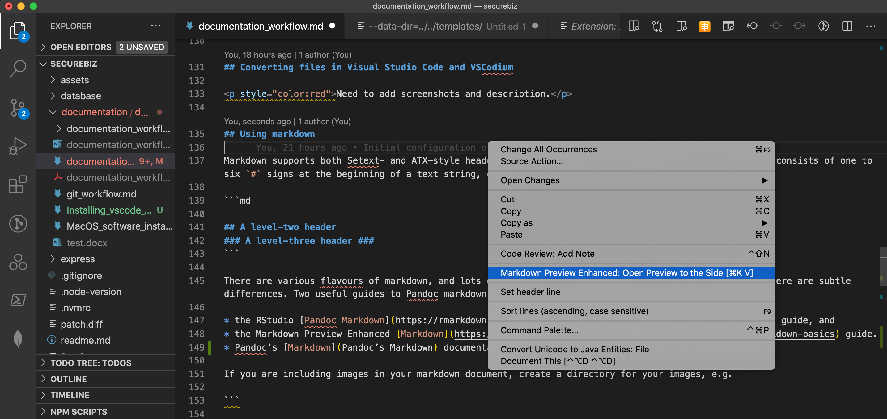
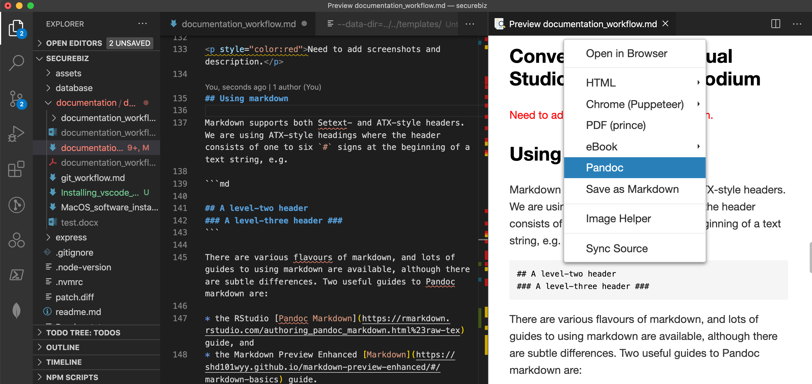

# Documentation workflow

There is a `documentation` directory in the main git repository. Directory structure should follow file directory structure in the squads channel in Microsoft Teams.

All documentation should be written in markdown syntax, this allows us to track changes in documentation and update documentation within our IDEs or editors as we make changes to the code base that impacts on the documentation.

## Suggested workflow

If the documentation relates to code edits or changes in code base, the documents could be created or edited within the same branch and be part of the PR for that task.

If the document is unrelated to code, it can be in a separate branch and PR.

Workflow should follow our [git workflow](git_workflow.md)

## Requirements

* [Pandoc](https://pandoc.org/installing.html/)
* IDE or editor with markdown support, including markdown linting.

There are a number of ways of generating PDF files:
1. Puppeteer (using Chrome)
2. [Prince XML](https://www.princexml.com/)
3. Pandoc

Puppeteer is the easiest solution.

The Pandoc PDF generation requires a TeX/LaTeX install, which are notoriously massive. If you do wish to just use Pandoc (for a variety of conversions), SVG support requires `librsvg`, Pandoc filters require Python, and PDF generation requires a LaTeX install.

## Installing dependencies

### MacOS

Using [Homebrew](https://brew.sh/):

```zsh
brew update
brew install pandoc
brew install --cask prince
```

To install additional Pandoc dependencies:

```zsh
brew install librsvg python homebrew/cask/basictex
```

Edit command to exclude packages you do not require.

### Ubuntu (Linux)

To use the packaged version fo Pandoc in the Ubuntu package repositories: (Commands will vary depending upon Linux distro, version and architecture - consult https://www.princexml.com/download/ page and select suitable version)

```zsh
sudo apt-get update
sudo apt-get install -y pandoc gdebi
wget https://www.princexml.com/download/prince_13.6-1_ubuntu20.04_amd64.deb
sudo gdebi prince_13.6-1_ubuntu20.04_amd64.deb
```

To install the latest version of pandoc:

```bash
sudo wget https://github.com/jgm/pandoc/releases/download/2.11.2/pandoc-2.11.2-1-amd64.deb
sudo dpkg -i pandoc-2.11.2-1-amd64.deb
```

### Windows

Currently there are no Pandoc or Prince XML formulae for Windows Package Manager Client, so instructions below use [Chocolatey](https://chocolatey.org/):

```

choco install pandoc
choco install prince
```

Alternatively, you can download windows installers.

To install additional Pandoc dependencies:

```

choco install rsvg-convert python miktex
```

Edit command to exclude packages you do not require.

## Converting files in the terminal

### Convert Markdown document to Word document

The basic command to convert a markdown document to a Word document is:

```zsh

pandoc test.md -f markdown -t docx -o test.docx
```

If the markdown document has fenced code blocks, you should specify syntax highlighting theme to be used:

```zsh

pandoc test.md -f markdown -t docx --highlight-style tango -o test.docx
```

### Convert multiple Markdown documents to one Word document

For larger documents that more than one squad member is authoring, it is possible to write a set of markdown documents, with each squad member responsible for each markdown document. The final Word document can be generated from the constituent markdown files:

```zsh

pandoc one.md two.md three.md -f markdown -t docx --reference-doc our_reference.docx --highlight-style tango -o test.docx
```

#### Advanced features

A range of options are available, including the ability to autogenerate a table of contents, or use a reference.dcx file to act as a template and theme for the generated Word document rather than relying on the default template and theme in Word. Refer to the [Pandoc manual](https://pandoc.org/MANUAL.html#options).

### Convert Word document to Markdown document

```zsh

pandoc test.docx -s --no-wrap --extract-media ./doc_title -f docx -t markdown -o test.md
```

When Pandoc is converting a Word doc that contains images, the images are extracted into a directory `media`. If you are converting multiple Word documents in the same directory, you will overwrite files. To avoid this, use the `--extract-media` option to specify a directory to insert the generated media directory into.

## Converting files in Visual Studio Code and VSCodium

<p style="color:red">Need to add screenshots and description.</p>

## Using markdown

Markdown supports both Setext- and ATX-style headers. We are using ATX-style headings where the header consists of one to six `#` signs at the beginning of a text string, e.g.

```md

## A level-two header
### A level-three header ###
```

There are various flavours of markdown, and lots of guides to using markdown are available, although there are subtle differences. Two useful guides to Pandoc markdown are:

* the RStudio [Pandoc Markdown](https://rmarkdown.rstudio.com/authoring_pandoc_markdown.html%23raw-tex) guide, and
* the Markdown Preview Enhanced [Markdown](https://shd101wyy.github.io/markdown-preview-enhanced/#/markdown-basics) guide.
* Pandoc’s [Markdown](Pandoc’s Markdown) documentation

If you are including images in your markdown document, create a directory for your images, e.g.

```

setup_instructions.md
setup_instructions\media\sourcetree.png
setup_instructions\media\git_bash.png
setup_instructions\media\bitbucket_repository.png
```

Give images meaningful names.

For those squad members using using [Visual Studio Code](https://code.visualstudio.com/) or [VSCodium](https://vscodium.com/), the extensions [Markdown Preview Enhanced](https://shd101wyy.github.io/markdown-preview-enhanced/#/) and _markdownlint_ are recommended. They can be installed via vscode's internal package manager, or form the command line:

```zsh

code --install-extension davidanson.vscode-markdownlint
code --install-extension shd101wyy.markdown-preview-enhanced
```

Alternatively, if you are using `zsh` and `Oh My Zsh`:

```zsh

vscie davidanson.vscode-markdownlint
vscie shd101wyy.markdown-preview-enhanced
```

[Markdown Preview Enhanced](https://shd101wyy.github.io/markdown-preview-enhanced/#/) is also available for [Atom](https://atom.io/).

### Converting a markdown document.

1. Add front matter to the beginning of the markdown document. We are using a YAML metadata block, where valid variables include title, author, date, subtitle, abstract, keywords, subject, description, category, output. For example the front matter in this document is:
```yaml
---
title: "Habits"
output:
  word_document:
    pandoc_args: [
      "--csl", "/var/csl/acs-nano.csl"
    ]
---
```
2. Right click in the markdown document, and select __Markdown Preview Enhanced: Open Preview to the Side__ from the popup menu.

3. Right mouse click in the preview document and select __Pandoc__ from the popup menu. This will generate a word document in the same directory as the markdown file, and open the document in MS Word.


## Repository structure

The repository structure should be the same as in Microsoft Teams channel, i.e. the git repo path `/documents/development/general/git_workflow.md` would be equivalent to `_T3 2020 Files > Development > General > git_workflow.docx`

The structure would be:

* documentation
    * application_security
    * deployment_and_testing
    * development
        * frontend
        * backend
        * general
    * new_members
        * start_pack
    * project_management
        * application_security
        * deployment_and_testing
        * design_and_planning
        * development
        * documentation
        * project_meetings
        * workflow
    * showcase
    * squad_demos
    * t3_handover
